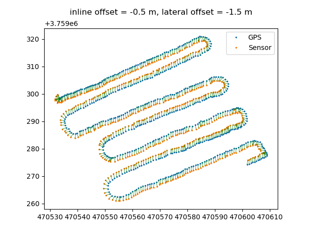
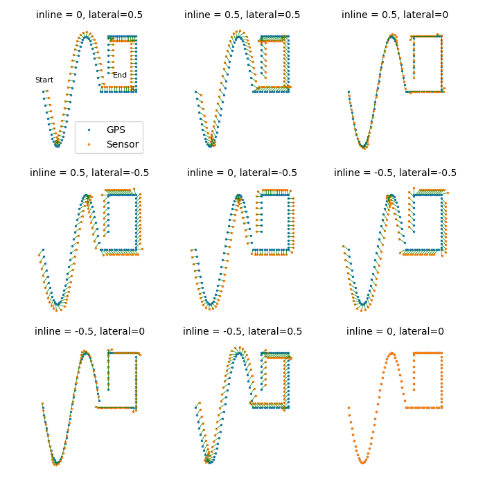

# sensoff

Corrects field transect coordinates when an on-the-go sensor is offset from the
GPS on a mobile survey platform.

```
$ python -m sensoff --ioff -0.5 --loff -1.5 --skiprows 1 sensor_survey_GAMMA.csv
```



Determining the position of an offset on-the-go sensor is relatively
straightforward if the heading of the mobile platform at each GPS reading is
known. The problem is that the heading is not known: the platform's position is
recorded by the GPS, but not its direction. To calculate the sensor location,
the unknown heading at each point is estimated to be a weighted average of the
bearings of the prior and subsequent legs of the traverse. 

See:

Scudiero, E., D. L. Corwin, P. T. Markley, A. Pourreza, T. Rounsaville, and T.
H. Skaggs. 2020. A novel platform for on-the-go sensing in micro-irrigated
orchards. Computers and Electronics in Agriculture. *In Preparation*.

### Install

```
$ pip install sensoff
```

### Examples

#### From the command line: 

```
$ python -m sensoff --help

usage: sensoff [-h] [--ioff IOFF] [--loff LOFF] [--xcol XCOL] [--ycol YCOL] [--skiprows SKIPROWS] [--sep SEP] [--outfile OUTFILE] FILE

Correct transect coordinates when sensor is offset from GPS

positional arguments:
  FILE                 Delimited text file with GPS x,y coordinates

optional arguments:
  -h, --help           show this help message and exit
  --ioff IOFF          inline sensor offset, positive in direction of travel
                       (default: 0)
  --loff LOFF          lateral sensor offset, positive to left (facing
                       forward) (default: 0)
  --xcol XCOL          x-coordinate column (1-based) (default: 1)
  --ycol YCOL          y-coordinate column (1-based) (default: 2)
  --skiprows SKIPROWS  number of datafile header rows to skip (default: 0)
  --sep SEP            datafile delimiter (default: ",")
  --outfile OUTFILE    write output to file

             lateral_offset

                  (+)

                   |            Direction of travel -->
             >>>>>>>>>>>>>
             >     |     >
     (-)  --->--- GPS --->---  (+) inline_offset
             >     |     >
             >>>>>>>>>>>>>
                   |
                         (mobile platform) 
                  (-)

```

On the platform, sensor is 1.1 m behind and 0.5 m to the left of the GPS

```
$ python -m sensoff --ioff -1.1 --loff 0.5 datafile1.csv
```

The first row of datafile2 is a header row that should be ignored

```
$ python -m sensoff --ioff -1.1 --loff 0.5 --skiprows 1 datafile2.csv
```

Write output to a file instead of stdout

```
$ python -m sensoff --ioff -1.1 --loff 0.5 --outfile out.csv datafile1.csv
```

Use a delimiter other than "," and non-default data columns

```
$ python -m sensoff --ioff -1.1 --loff 0.5 --xcol 2 --ycol 3 --sep " " datafile3.txt
```

#### From python:

```
In [1]: from sensoff import GPSCoords

In [2]: survey = GPSCoords.from_csv("dummy0.csv", skiprows=1)

In [3]: sensor_coords = survey.to_sens_coords(inline_offset=1, lateral_offset=1)

In [4]: print(sensor_coords)

[(470534.417169402, 3759299.464556901), (470534.0298120643, 3759299.8127804487), (470534.3431564087, 3759299.670017598), (470534.9321063309, 3759298.5976250498), (470535.09349569224, 3759298.1006433647), (470534.72614854627, 3759298.08100075), (470534.3293269551, 3759297.1871465445), (470533.71902153065, 3759296.9455717937), (470532.8883022137, 3759296.816779944)]

In [5]: help(GPSCoords.from_csv)

from_csv(
    csvfile, sep: 'str' = ',', xcol: 'int' = 1, ycol: 'int' = 2, skiprows: 'int' = 0
) -> 'GPSCoords'
    csvfile : csv filename or object
        Delimited file containing GPS coordinates for OTG survey.
    xcol : int, optional
        Column in datafile with x-coordinates. Default is 1.
    ycol : int, optional
        Column in datafile with y-coordinates. Default is 2.
    sep : str, optional
        Delimiter used in coordinate datafile. Default is ",".
    skiprows : int, optional
        Number of header rows in datafile. Default is 0.

In [6]: help(GPSCoords.to_sensor_coords)

def to_sensor_coords(
    self, inline_offset: int = 0, lateral_offset: int = 0
) -> List[Point]:
    inline_offset : float, optional
        Sensor offset distance inline with the direction of travel.
        Positive in the direction of travel. Default is 0.
    lateral_offset : float, optional
        Sensor offset distance lateral to the direction of travel.
        Positive to the left (facing forward). Default is 0.

```

#### Offsets demo:


